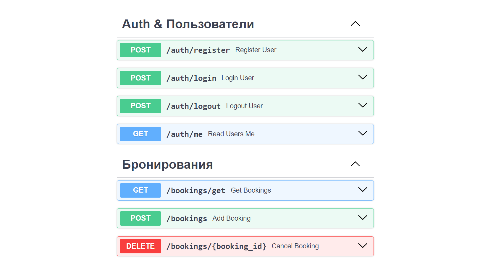
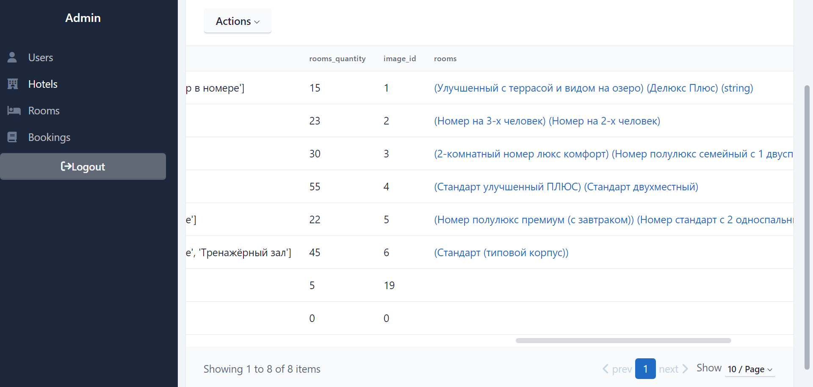

# Описание
**Booking-FastAPI - это упрощенный сервис Бронирования Отелей. Он позволяет зарегистрироваться, забронировать отель и отменить бронь.**



## О проекте:
Разработал веб-приложение по бронированию отелей на стеке FastAPI, PostgreSQL, Redis,
Celery, Docker:
- Весь код реализован на фреймворке FastAPI
- Реализовал авторизацию пользователей с ролевой моделью на основе JWT через cookie
- Реализовал CRUD для управления отелями и номерами
- Взаимодействие с базой осуществлялось через SQLAlchemy (асинхронный вариант)
- Данные об отелях кэшируются в Redis для разгрузки базы данных PostgreSQL
- При бронировании отеля пользователю отправляется письмо. Асинхронная отправка писем
реализована через Celery
- Весь проект был развернут в Docker контейнерах при помощи Docker Compose


## Админ-панель (SQLAdmin)

### Отели


## Запуск приложения
Для запуска FastAPI используется веб-сервер uvicorn. Команда для запуска выглядит так:  
```
uvicorn app.main:app --reload
```

### Celery & Flower
Для запуска Celery используется команда  
```
celery --app=app.tasks.celery:celery worker -l INFO -P solo
```
Обратите внимание, что `-P solo` используется только на Windows, так как у Celery есть проблемы с работой на Windows.  
Для запуска Flower используется команда  
```
celery --app=app.tasks.celery:celery flower
``` 

### Dockerfile
Код для запуска Dockerfile:  
```
docker build .
```  
Команда также запускается из корневой директории, в которой лежит файл Dockerfile.

### Docker compose
Для запуска всех сервисов (БД, Redis, веб-сервер (FastAPI), Celery, Flower, Grafana, Prometheus) необходимо использовать файл docker-compose.yml и команды
```
docker compose build
docker compose up
```
Причем `build` команду нужно запускать, только если вы меняли что-то внутри Dockerfile, то есть меняли логику составления образа.
